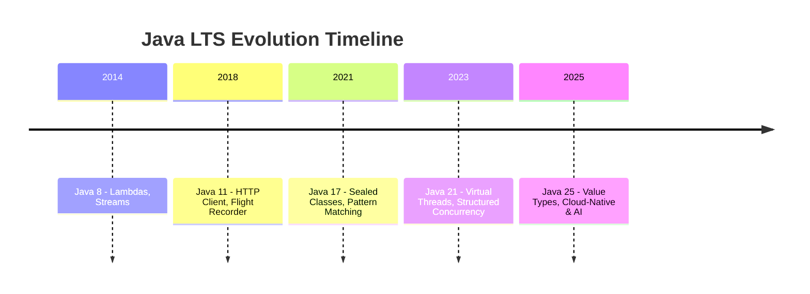

## Introduction: Why Java LTS Versions Matter for Enterprise Developers

Java continues to power enterprise systems, financial platforms, backend services, and cloud-native microservices at massive scale. With Java moving to a six-month release cycle, enterprises cannot upgrade every version safely.

That is where Long-Term Support (LTS) releases become critical.

### Why Java LTS is critical
- Long-term security updates and bug fixes
- Stability for mission-critical systems
- Vendor-backed support (Oracle, Red Hat, Azul, Amazon Corretto)
- Predictable upgrade lifecycle
- Continuous performance and memory improvements

This article explains the evolution of Java LTS versions from Java 8 to Java 25, covering Java LTS features, real-world use cases, performance gains, migration tips, and how to choose the right Java LTS in 2026.

---

## Java LTS Feature Timeline



---

## Java 8 LTS – The Foundation of Modern Java (2014)

### Key Features
- Lambda Expressions
- Stream API
- Optional
- Default interface methods
- Date & Time API (java.time)
- CompletableFuture

### Code Example
```java
List<String> activeUsers = users.stream()
    .filter(User::isActive)
    .map(User::getName)
    .toList();
```

### Real-World Use Cases
- Functional-style data processing
- Parallel execution pipelines
- Cleaner and expressive APIs

### Performance Improvements
- Improved CPU utilization
- Parallel stream execution

### Migration Tip
Java 8 is not recommended in 2026 due to security and dependency risks.

---

## Java 11 LTS – Enterprise Modernization (2018)

### Key Features
- Standard HTTP Client (HTTP/2)
- Flight Recorder and Mission Control
- Lambda parameter var
- Nest-based access control
- Epsilon Garbage Collector
- Removal of Java EE modules

### Code Example
```java
HttpClient client = HttpClient.newHttpClient();
HttpRequest request = HttpRequest.newBuilder()
    .uri(URI.create("https://api.example.com"))
    .GET()
    .build();

HttpResponse<String> response =
    client.send(request, HttpResponse.BodyHandlers.ofString());
```

### Use Cases
- Microservice communication
- Production profiling
- Modern HTTP handling

### Performance Improvements
- Faster startup
- Reduced memory footprint
- Improved G1 GC

### Migration Tips
- Replace HttpURLConnection
- Remove Java EE dependencies
- Enable Flight Recorder

---

## Java 17 LTS – Productivity & Safety (2021)

### Key Features
- Sealed Classes
- Pattern Matching for instanceof
- Foreign Function & Memory API (Incubator)
- Strong encapsulation
- Enhanced random generators
- Finalization deprecated

### Code Example
```java
public sealed abstract class Shape
    permits Circle, Rectangle {}

final class Circle extends Shape {}
final class Rectangle extends Shape {}
```

### Performance Improvements
- Better JIT optimizations
- Improved garbage collection

### Migration Tips
- Fix illegal reflective access
- Modularize applications

---

## Java 21 LTS – Concurrency Revolution (2023)

### Key Features
- Virtual Threads (Project Loom)
- Structured Concurrency
- Scoped Values
- Record Patterns
- Sequenced Collections
- String Templates

### Code Example
```java
try (var executor = Executors.newVirtualThreadPerTaskExecutor()) {
    executor.submit(() -> handleRequest());
}
```

### Performance Improvements
- Massive concurrency scalability
- Reduced memory per thread

### Migration Tips
- Replace thread pools
- Adopt structured concurrency gradually

---

## Java 25 LTS – Cloud-Native & AI-Ready (2025)

### Key Features
- Value Types
- Project Panama stabilized
- Built-in JVM telemetry
- Cloud-native startup optimization
- AI-assisted code analysis
- Advanced pattern matching

### Code Example
```java
public value Person(String name, int age) {}
```

### Performance Improvements
- Reduced GC pressure
- Faster container startup

### Migration Tips
- Use value types for DTOs
- Adopt telemetry APIs

---

## Java LTS Comparison Table

| Feature | Java 11 | Java 17 | Java 21 | Java 25 |
|------|------|------|------|------|
| HTTP Client | ✅ | ✅ | ✅ | ✅ |
| Sealed Classes | ❌ | ✅ | ✅ | ✅ |
| Virtual Threads | ❌ | ❌ | ✅ | Enhanced |
| Structured Concurrency | ❌ | ❌ | ✅ | Enhanced |
| Value Types | ❌ | ❌ | ❌ | ✅ |
| Native Interop | Incubator | Incubator | Improved | Stable |

---

## Benefits for Backend & Full-Stack Developers

- Faster startup for microservices
- Better scalability with virtual threads
- Lower infrastructure cost
- Built-in observability

---

## Choosing the Right Java LTS in 2026

| Scenario | Recommended LTS |
|--------|----------------|
| Legacy systems | Java 17 |
| Cloud-native apps | Java 21 or Java 25 |
| High-performance systems | Java 25 |

---

## Final Thoughts & Call to Action

Java LTS releases are strategic investments in performance, scalability, and maintainability.

**Action Items**
- Audit your Java version
- Upgrade incrementally
- Benchmark performance
- Train teams on modern Java

Try upgrading one service to Java 21 or Java 25 today and measure the results.

Happy Coding ☕
